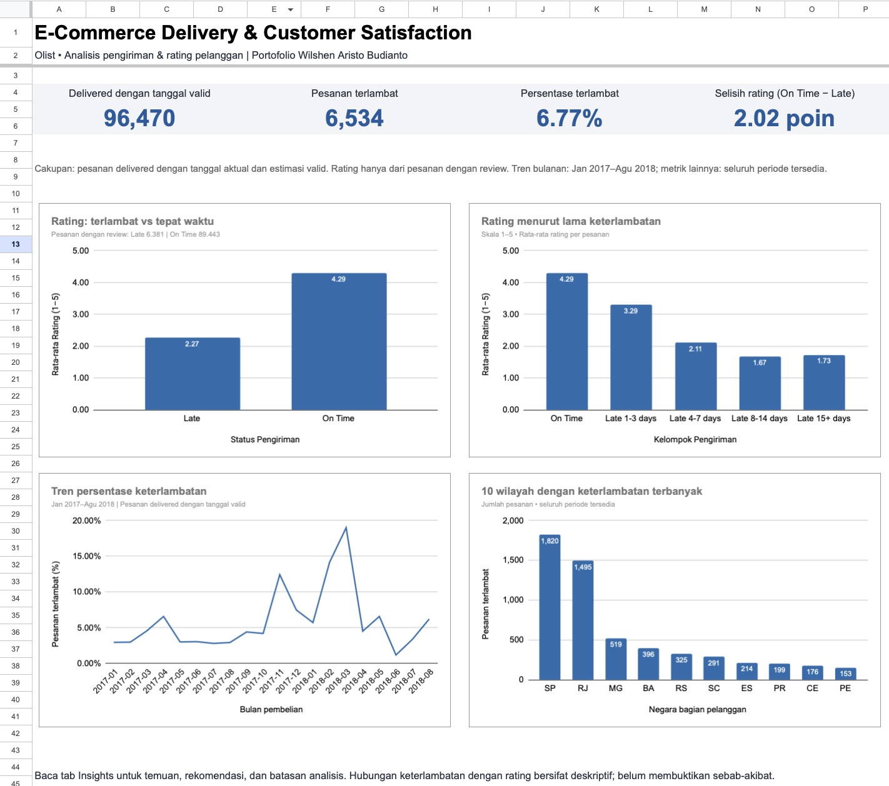

# E-Commerce Delivery & Customer Satisfaction

A Google Sheets analysis of delivery delays and customer review scores using the Olist Brazilian E-Commerce Public Dataset.

**Author:** Wilshen Aristo Budianto  
**Tools:** Google Sheets  
**Focus:** Data cleaning, data integration, exploratory analysis, and business recommendations

## Project Overview

This project explores how delivery timeliness relates to customer review scores and identifies periods and customer locations that warrant further investigation.

The analysis covers 99,441 orders. Delivery performance is calculated using 96,470 delivered orders with valid actual and estimated delivery dates.

## Business Questions

1. How do average review scores differ between late and on-time deliveries?
2. How do review scores vary across delay-duration groups?
3. Which purchase months have the highest late-delivery rates?
4. Which customer states account for the most late deliveries?

## Dashboard & Workbook

[Open the Google Sheets workbook](https://docs.google.com/spreadsheets/d/1OLdHgAJ5Y-ik8wq6UFw-l9ToQ3lv2_eVBGlbyMyIF-A/edit)

The workbook includes:

| Tab | Purpose |
| --- | --- |
| Dashboard | Key metrics and four analytical charts |
| Insights | Business findings, recommendations, and limitations |
| Summary | Calculations and aggregated results |
| Delivery_Analysis | Order-level delivery classifications and review scores |
| Reviews_By_Order | Average review score per order |
| Orders_Raw | Original order data |
| Reviews_Raw | Original review data |
| Customers_Raw | Original customer data |

## Data Source

**Dataset:** Brazilian E-Commerce Public Dataset by Olist  
**Platform:** Kaggle

Three source tables were used:

- Orders: order status and purchase/delivery timestamps.
- Reviews: customer review scores and associated order IDs.
- Customers: customer IDs and customer states.

The dataset belongs to its original providers. This repository presents an independent educational analysis.

## Data Preparation

1. Classified delivered orders as `Late`, `On Time`, or `Check Date`.
2. Compared actual and estimated delivery dates at calendar-day level.
3. Excluded eight delivered orders without valid dates from delivery-performance calculations.
4. Aggregated multiple reviews into one average score per order.
5. Joined review scores to orders using `order_id`.
6. Matched customer states using `customer_id`.
7. Created delay-duration groups and purchase-month fields.
8. Checked that grouped order counts reconciled with the overall totals.

Missing review scores were left blank rather than replaced with zero.

**Google Sheets functions used:** `ARRAYFORMULA`, `QUERY`, `VLOOKUP`, `COUNTIFS`, `AVERAGEIF`, `IF`, `IFNA`, `ISNUMBER`, `INT`, `TEXT`, `FILTER`, `UNIQUE`, and `SORT`.

## Key Findings

### 1. Late deliveries have lower average review scores

| Delivery status | Average review score | Orders with a review score |
| --- | ---: | ---: |
| Late | 2.27 | 6,381 |
| On Time | 4.29 | 89,443 |

The difference is **2.02 points** on a five-point scale.

Overall, **6,534 of 96,470 eligible delivered orders were late**, giving a late-delivery rate of **6.77%**.

### 2. Longer delays generally coincide with lower ratings

| Delivery group | Average review score | Orders with a review score |
| --- | ---: | ---: |
| On Time | 4.29 | 89,443 |
| Late 1–3 days | 3.29 | 1,852 |
| Late 4–7 days | 2.11 | 1,748 |
| Late 8–14 days | 1.67 | 1,446 |
| Late 15+ days | 1.73 | 1,335 |

The relationship is not strictly decreasing: the 15+ day group has a slightly higher average score than the 8–14 day group.

### 3. March 2018 has the highest late-delivery rate in the selected trend period

Among purchase months from **January 2017 to August 2018**, March 2018 has the highest late-delivery rate:

- **18.96%** late-delivery rate.
- **1,328** late orders out of **7,003** eligible delivered orders.

Months are grouped by purchase date, not delivery date.

### 4. SP and RJ account for approximately half of late deliveries

| Customer state | Late orders | Late-delivery rate within the state |
| --- | ---: | ---: |
| São Paulo (SP) | 1,820 | 4.49% |
| Rio de Janeiro (RJ) | 1,495 | 12.11% |

Together, SP and RJ account for **50.73% of all late orders**.

SP has the largest late-order count, while RJ has a higher late-delivery rate. Both volume and rate matter when prioritizing investigations.

## Business Recommendations

- Test proactive delay notifications and customer-support outreach.
- Pilot escalation before a delay reaches four days. This is a proposed threshold to test, not a proven optimum.
- Investigate seller preparation and transit times for orders purchased in March 2018.
- Prioritize investigation of deliveries to SP and RJ, then segment by seller, route, and purchase month.

These are proposed actions. Their effects on delivery performance and customer ratings have not been measured.

## Metric Definitions

- **Late delivery:** Actual delivery date is later than the estimated delivery date.
- **On-time delivery:** Actual delivery date is on or before the estimated delivery date.
- **Late-delivery rate:** Late orders divided by delivered orders with valid dates.
- **Average review score:** Mean of order-level review scores. Multiple reviews for one order are averaged first.
- **Rating gap:** Average on-time review score minus average late review score.

## Limitations

- This is a descriptive analysis and does not establish causation.
- Review scores reflect the overall customer experience, not delivery alone.
- Rating comparisons include only orders with reviews; review coverage differs between groups.
- Review timing relative to delivery has not been evaluated.
- Valid-date checks confirm numeric dates, not every possible chronological inconsistency.
- The monthly chart covers January 2017–August 2018; other analyses use all available periods.
- Historical findings should not be interpreted as current Olist performance.
